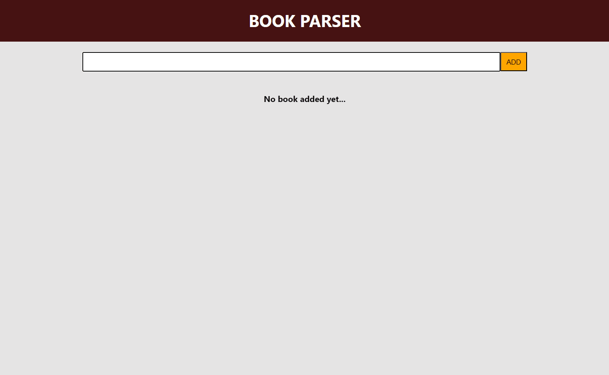

<h1> CRUD APP </h1>

"Create-Read-Update-Delete" işlemlerini gerçekleştiren bir kitap yönetim uygulaması.

<h2> Kullanılan Teknolojiler </h2>

- **React**: Uygulamanın frontend geliştirmesi  

<h2> Projeyi çalıştırma </h2>

- Gerekli bağımlılıkları yükleyin:
npm install

- Projeyi başlatın:
npm start

<h2> Screen Gif </h2>

